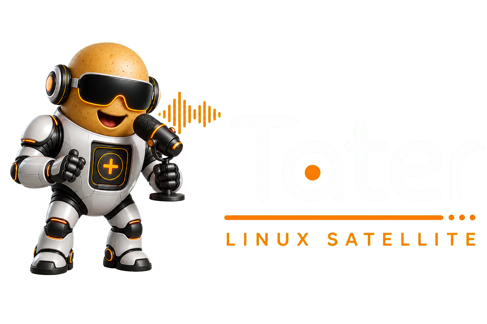

<div align="center">
  <a href="https://taterassistant.com">
    
  </a>
</div>
<h3 align="center">
  <a href="https://taterassistant.com">taterassistant.com</a>
</h3>

# Tater Linux Satellite

A Linux-native voice satellite runtime for
[Tater](https://github.com/TaterTotterson/Tater).

This project turns a Linux computer, Raspberry Pi, or robot such as Reachy Mini
into a dedicated Tater voice satellite. It detects wake words locally, streams
speech to Tater, plays Tater's reply, and reconnects automatically if the
network or Tater restarts.

The satellite connects outbound to Tater's native WebSocket protocol. Tater
handles pairing, speech recognition, conversation, tools, text-to-speech, and
device management; this runtime handles the local microphone, speaker, wake
word, and optional peripherals.

## Features

- Native Tater pairing with a short pairing code
- Durable per-device token stored with owner-only permissions
- 16 kHz mono PCM audio streaming to Tater
- Reply, announcement, timer, and continued-conversation playback
- Local
  [microWakeWord](https://github.com/kahrendt/microWakeWord) and
  [openWakeWord](https://github.com/dscripka/openWakeWord) detection
- Custom wake-word support through
  [Tater Wake Words](https://github.com/TaterTotterson/Tater-Wake-Words)
- Automatic reconnect and session recovery
- PulseAudio and PipeWire audio support
- Optional WebSocket API for buttons, LEDs, and other peripherals
- Linux AMD64 and ARM64 support
- Python 3.11 through 3.13

## Requirements

- A running [Tater Assistant](https://taterassistant.com) instance
- Linux on AMD64 or ARM64
- A microphone and speaker
- Python 3.11 or newer
- PulseAudio or PipeWire with PulseAudio compatibility
- Network access from the satellite to Tater

A microphone array with onboard noise reduction and echo cancellation will
usually give the best far-field results.

## Quick Start

### 1. Create a pairing code

Open Tater, go to **Satellites**, choose **Add Satellite**, and keep the pairing
code visible.

### 2. Install the satellite

```sh
git clone https://github.com/TaterTotterson/Tater-Linux-Satellite.git
cd linux-voice-assistant
./script/setup
```

### 3. Pair and run

Replace the Tater URL and pairing code with your own:

```sh
./script/run \
  --name "Office Satellite" \
  --tater-url http://tater.local:8501 \
  --tater-token 123456 \
  --tater-token-file ~/.config/tater-linux-satellite/device-token \
  --tater-device-id office-satellite \
  --tater-board linux \
  --tater-room office
```

The base HTTP URL is converted to Tater's native satellite WebSocket endpoint
automatically. After the first successful connection, the durable device token
is saved to `--tater-token-file`; later starts can omit `--tater-token`.

The satellite reconnects automatically when Tater or the network becomes
available again.

## Audio And Wake Words

List available audio devices:

```sh
./script/run --list-input-devices
./script/run --list-output-devices
```

Select devices when starting the satellite:

```sh
./script/run \
  --audio-input-device "INPUT DEVICE" \
  --audio-output-device "OUTPUT DEVICE" \
  --tater-url http://tater.local:8501 \
  --tater-token-file ~/.config/tater-linux-satellite/device-token
```

Wake-word models use a matching `.json` configuration and `.tflite` model.
Browse shared models and custom-word tooling in
[Tater Wake Words](https://github.com/TaterTotterson/Tater-Wake-Words), then
select an installed model with `--wake-model`.

Run `./script/run --help` for all audio, wake-word, sound, timer, and peripheral
options.

## Tater Settings

| Command-line option | Environment variable | Purpose |
| --- | --- | --- |
| `--tater-url` | `TATER_URL` | Tater base URL or native WebSocket URL |
| `--tater-token` | `TATER_TOKEN` | One-time pairing code or existing device token |
| `--tater-token-file` | `TATER_TOKEN_FILE` | Loads and stores the durable paired token |
| `--tater-device-id` | `TATER_DEVICE_ID` | Stable ID reported to Tater |
| `--tater-board` | `TATER_BOARD` | Hardware identifier, such as `linux` or `reachy_mini` |
| `--tater-room` | `TATER_ROOM` | Optional room reported to Tater |
| `--tater-reconnect-seconds` | `TATER_RECONNECT_SECONDS` | Delay between reconnect attempts |

See [.env.example](.env.example) for audio, wake-word, sound, and runtime
settings.

## Related Tater Projects

- [Tater Assistant](https://taterassistant.com) — downloads, documentation, and
  project information
- [Tater](https://github.com/TaterTotterson/Tater) — the Tater Assistant core
- [Tater Native Firmware](https://github.com/TaterTotterson/Tater-Native-Firmware)
  — native firmware for supported ESP32-S3 satellites
- [Tater Wake Words](https://github.com/TaterTotterson/Tater-Wake-Words) —
  shared wake-word packages and training requests
- [Tater Voice Satellite for Reachy Mini](https://huggingface.co/spaces/TaterTotterson/tater_voice_sat)
  — satellite-only Reachy Mini app
- [Tater Reachy Standalone](https://huggingface.co/spaces/TaterTotterson/tater_reachy_standalone)
  — Tater and its native satellite running together on Reachy Mini

## Development

```sh
./script/setup --dev
./script/test
./script/lint
```

This fork builds on the Linux audio and wake-word foundation from
[OHF-Voice/linux-voice-assistant](https://github.com/OHF-Voice/linux-voice-assistant).

## License

Licensed under the [Apache License 2.0](LICENSE.md).
